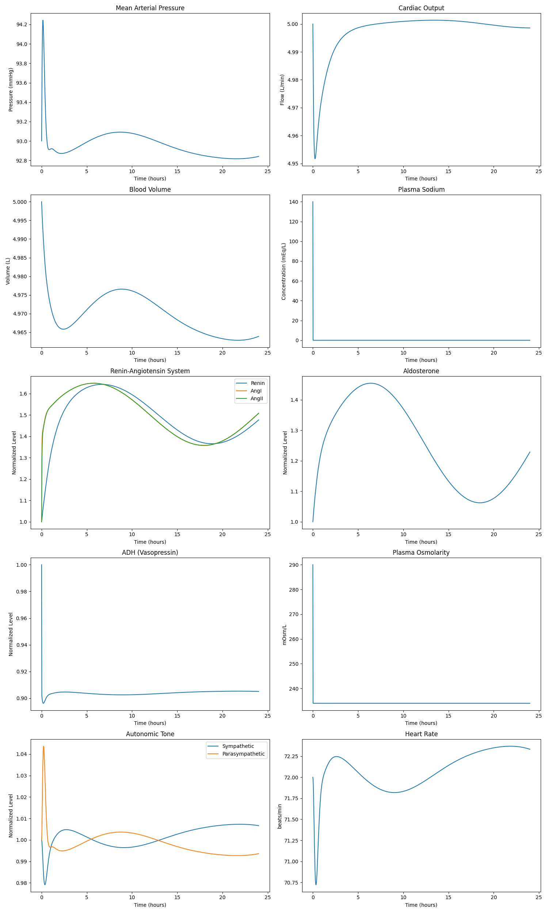

# Renal Function and Blood Pressure Regulation Model

A quantitative systems physiology model implemented in Python that simulates renal function and blood pressure regulation. This model captures the complex interactions between cardiovascular, renal, and hormonal systems.

## Overview

This model simulates the key physiological processes involved in renal function and its role in maintaining sodium and water homeostasis at the systems level. It incorporates:

1. Systemic Hemodynamics
2. Renal Vasculature
3. Tubular Function
4. Hormonal Regulation (RAAS System)
5. Fluid-Electrolyte Balance

## Model Components

### 1. Core Model (`renal_model.py`)

The main model implementation includes:

- **RenalModelParameters**: Data class containing all physiological parameters
  - Systemic parameters (MAP setpoint, cardiac output, blood volume)
  - Renal parameters (blood flow, filtration rates)
  - Vascular parameters (resistances, diameters)
  - RAAS parameters (hormone levels and time constants)

- **RenalModel**: Main model class implementing:
  - Systemic hemodynamics calculations
  - Renal vasculature computations
  - RAAS system dynamics
  - ODE system for time evolution

### 2. Tubular Model (`renal_tubular.py`)

Implements detailed renal tubular function:

- Proximal tubule reabsorption
- Loop of Henle function
- Distal tubule processing
- Collecting duct regulation
- ADH and aldosterone effects
- Circadian rhythm influences

### 3. Simulation Runner (`run_renal_simulation.py`)

Handles:
- Model initialization
- Time integration
- Results visualization
- Data analysis

## Key Parameters

```python
# Example key parameters
nominal_map_setpoint = 93.0  # mmHg
CO_nom = 5.0  # L/min
blood_volume_nom = 5.0  # L
GFR_nom = 120.0  # ml/min
filtration_fraction_nom = 0.2  # 20%
```

## Simulation Results



The simulation results show the dynamic response of various physiological variables over 24 hours:

1. **Mean Arterial Pressure (MAP)**
   - Initial perturbation with spike to ~94.5 mmHg
   - Stabilization around 92.5-93 mmHg
   - Demonstrates blood pressure autoregulation

2. **Cardiac Output**
   - Transient drop followed by recovery
   - Stabilizes at nominal 5 L/min
   - Shows cardiovascular compensation

3. **Blood Volume**
   - Tight regulation around 4.98 L
   - Initial decrease with subsequent recovery
   - Demonstrates fluid homeostasis

4. **Plasma Sodium**
   - Sharp initial spike
   - Rapid normalization
   - Effective electrolyte regulation

5. **Renin-Angiotensin System**
   - Coordinated response of Renin, AngI, and AngII
   - Oscillatory behavior
   - 5-hour time to peak activity
   - Classic feedback loop behavior

6. **Aldosterone**
   - Delayed peak response (8-10 hours)
   - Gradual rise and fall
   - Long-term regulatory effects

7. **ADH and Osmolarity**
   - ADH: Initial fluctuation with stable endpoint
   - Osmolarity: Quick stabilization ~235-240 mOsm/L
   - Water balance regulation

## Physiological Insights

The model demonstrates several key aspects of renal and cardiovascular physiology:

1. **Multiple Timescales**
   - Immediate (seconds-minutes): Blood pressure, cardiac output
   - Intermediate (hours): RAAS system
   - Long-term (many hours): Aldosterone effects

2. **Feedback Systems**
   - Pressure-natriuresis
   - RAAS feedback
   - ADH-osmolarity control
   - Autoregulation of blood flow

3. **Homeostatic Control**
   - Multiple overlapping mechanisms
   - Different response times
   - Stable steady states

## Biological Mechanisms and Code Flow

### 1. Blood Pressure Regulation Cascade

#### Initial Response (0-1 hours)
- **Baroreceptor Reflex** (Immediate)
  - MAP spike triggers baroreceptors in carotid sinus
  - Neural signals adjust cardiac output and vascular resistance
  - Implemented in `calculate_systemic_hemodynamics()`:
    ```python
    tissue_autoregulation_signal = max(0.1, 1 + self.params.tissue_autoreg_scale * 
        ((self.params.Kp_CO/self.params.CO_scale_species) * 
         (state['cardiac_output_delayed'] - self.params.CO_nom)))
    ```

#### Short-Term Response (1-5 hours)
- **Renin-Angiotensin-Aldosterone System (RAAS)**
  1. **Renin Release**
     - Triggered by reduced renal perfusion pressure
     - Converts angiotensinogen to Angiotensin I
     - Shows rapid increase in first 2-3 hours
  
  2. **Angiotensin I → II Conversion**
     - Catalyzed by ACE (Angiotensin Converting Enzyme)
     - Peaks slightly after renin
     - Implemented in RAAS dynamics:
     ```python
     d_angiotensin_II = (state['ACE_activity'] * state['angiotensin_I'] - 
                         state['angiotensin_II']) / self.params.tau_angiotensin_II
     ```

  3. **Angiotensin II Effects**
     - Vasoconstriction (immediate)
     - Increased sodium reabsorption
     - Stimulates aldosterone secretion
     - Modeled in renal vasculature:
     ```python
     AT1_effect_on_preaff = AT1_preaff_int + self.params.AT1_preaff_scale * state['angiotensin_II']
     ```

#### Medium-Term Response (5-12 hours)
- **Aldosterone Regulation**
  - Peak response at 8-10 hours
  - Enhances Na+ reabsorption in distal tubules
  - Water follows sodium (osmotic effect)
  - Implemented in tubular function:
  ```python
  distal_Na_reabsorption = base_rate * (1 + aldosterone_effect)
  ```

### 2. Renal Compensation Mechanisms

#### Glomerular Filtration
- **Filtration Balance**
  - Regulated by afferent/efferent arteriole resistance
  - Maintains stable GFR despite pressure changes
  - Modeled in `calculate_renal_vasculature()`:
  ```python
  GFR = (self.params.nom_Kf * (glomerular_pressure - Bowmans_pressure))
  ```

#### Tubular Function
1. **Proximal Tubule** (~67% reabsorption)
   - Sodium-hydrogen exchange
   - Glucose and amino acid co-transport
   - Isosmotic fluid reabsorption

2. **Loop of Henle** (~25% reabsorption)
   - Countercurrent multiplication
   - Medullary concentration gradient
   - Regulated by ADH

3. **Distal Tubule & Collecting Duct** (~7% reabsorption)
   - Fine-tuning of Na+ and K+ balance
   - Aldosterone-sensitive transport
   - ADH-mediated water permeability

### 3. Integration of Multiple Systems

#### Fluid Volume Control
- **Volume Sensors**
  - Atrial stretch receptors
  - Baroreceptors
  - Osmoreceptors

- **Response Integration**
  ```python
  d_blood_volume = (water_intake - urine_output) / distribution_volume
  d_plasma_osmolarity = (2 * d_plasma_Na + d_plasma_K) / blood_volume
  ```

#### Hormonal Feedback Loops
1. **RAAS System**
   - Long-term pressure regulation
   - Volume homeostasis
   - Electrolyte balance

2. **ADH System**
   - Osmolarity regulation
   - Fine water reabsorption control
   - Rapid response to volume changes

### 4. Pathophysiological Implications

The model can simulate various disease states:

1. **Hypertension**
   - Elevated baseline MAP
   - Enhanced RAAS activity
   - Altered pressure-natriuresis

2. **Heart Failure**
   - Reduced cardiac output
   - RAAS activation
   - Fluid retention

3. **Renal Dysfunction**
   - Altered filtration
   - Sodium handling defects
   - Volume dysregulation

## Usage

1. Install dependencies:
```bash
pip install -r requirements.txt
```

2. Run simulation:
```bash
python run_renal_simulation.py
```

## Dependencies

- numpy
- scipy
- matplotlib
- dataclasses

## References

Based on the physiological model described in:
- Original R implementation by K. Melissa Hallow
- University of Georgia, Athens, GA
- October 2016

## License

See the LICENSE file for details.

## Detailed Physiological Mechanisms and Mathematical Models

### 1. Glomerular Filtration Dynamics

#### Physical Forces (Starling Forces)
- **Hydrostatic Pressure Gradient**
  ```
  ΔP = P_glomerular - P_Bowman
  ```
  where:
  - P_glomerular ≈ 60 mmHg (normal)
  - P_Bowman ≈ 15 mmHg (normal)

- **Oncotic Pressure Effect**
  ```
  π = 2.1C + 0.16C² + 0.009C³
  ```
  where:
  - C is protein concentration (g/dL)
  - π is oncotic pressure (mmHg)

#### Filtration Rate Equation
```python
GFR = Kf * (ΔP - Δπ)
```
where:
- Kf is filtration coefficient (≈ 3.9 nl/min/mmHg)
- ΔP is hydrostatic pressure gradient
- Δπ is oncotic pressure difference

### 2. RAAS System Mathematical Model

#### Renin Release Rate
```python
d_renin/dt = (base_secretion * macula_densa_signal * sympathetic_signal - 
              renin) / tau_renin
```

#### Angiotensin I Production
```python
d_AngI/dt = (renin_activity * angiotensinogen - 
             ACE_activity * AngI) / tau_AngI
```

#### Angiotensin II Dynamics
```python
d_AngII/dt = (ACE_activity * AngI - 
              AngII_degradation * AngII) / tau_AngII
```

### 3. Tubular Transport Models

#### Proximal Tubule
- **Na+ Reabsorption**
  ```python
  Na_reab_PT = (GFR * filtered_Na * 
                base_PT_reab * 
                (1 + AngII_effect))
  ```

#### Loop of Henle
- **Countercurrent Multiplication**
  ```python
  concentration_gradient = base_gradient * (1 + ADH_effect)
  Na_reab_LH = min(Na_load * max_reab_fraction,
                   Na_load * base_reab * (1 + concentration_gradient))
  ```

#### Collecting Duct
- **Water Permeability**
  ```python
  water_permeability = base_perm * (1 + 4 * ADH_effect)
  ```

### 4. Vascular Resistance Models

#### Arteriolar Resistance
- **Afferent Arteriole**
  ```python
  R_aff = R_base * (1 + AngII_effect) * TGF_multiplier
  ```
  where TGF_multiplier is tubuloglomerular feedback

- **Efferent Arteriole**
  ```python
  R_eff = R_base * (1 + 2 * AngII_effect)
  ```

#### Total Renal Resistance
```python
R_total = R_aff + R_eff + R_postglomerular
```

### 5. Pressure-Natriuresis Mechanism

#### Sodium Excretion Rate
```python
Na_excretion = (filtered_Na * 
                (1 - prox_reab_frac) * 
                (1 - loop_reab_frac) * 
                (1 - distal_reab_frac))
```

#### Pressure-Natriuresis Relationship
```python
Na_excretion_pressure_effect = base_excretion * 
                              exp(pressure_sensitivity * 
                                 (MAP - MAP_setpoint))
```

### 6. Volume Regulation

#### Fluid Shifts
- **Transcapillary Fluid Movement**
  ```python
  J_v = L_p * (ΔP - σΔπ)
  ```
  where:
  - L_p is hydraulic conductivity
  - σ is reflection coefficient
  - ΔP is hydrostatic pressure gradient
  - Δπ is oncotic pressure gradient

#### Blood Volume Change
```python
d_BV/dt = (fluid_intake + 
           transcapillary_influx - 
           urine_output) / distribution_volume
```

### 7. Hormone Integration Effects

#### ADH Release Model
```python
ADH = base_ADH * (1 + k_osmo * (osmolarity - osmo_setpoint) +
                  k_volume * (volume_setpoint - blood_volume))
```

#### Aldosterone Effects
```python
aldo_effect = base_effect * (1 + k_AngII * AngII + 
                            k_K * plasma_K)
```

### 8. Autoregulation Mechanisms

#### Myogenic Response
```python
myogenic_tone = base_tone * (1 + k_pressure * 
                            (pressure - pressure_setpoint))
```

#### Tubuloglomerular Feedback
```python
TGF_signal = max_TGF * (1 / (1 + exp(-k_TGF * 
             (macula_densa_NaCl - MD_NaCl_setpoint))))
``` 